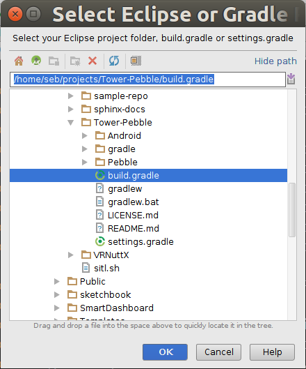
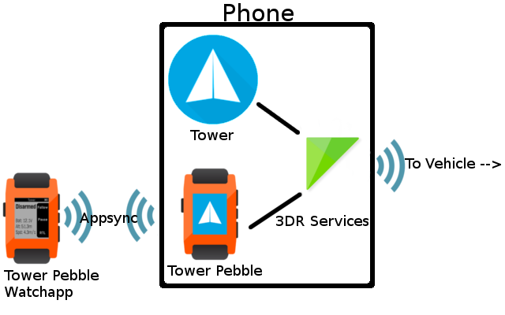
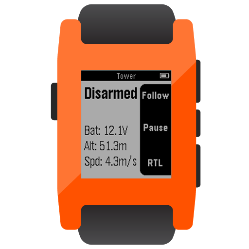
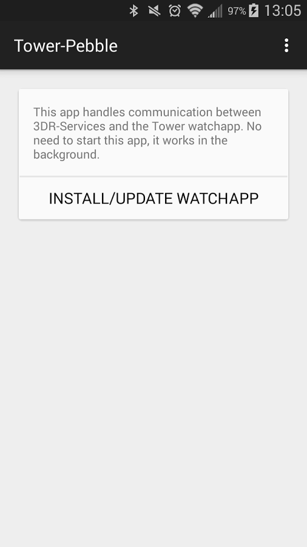

==================
Tower-Pebble
==================

In this example, we will learn about the `Tower Pebble watchapp <http://apps.getPebble.com/en_US/application/54d54fede8bb36ea9d00001f>`_ and `Android companion app <https://play.google.com/store/apps/details?id=org.droidplanner.pebble>`_.

Project Setup
=============

Clone Tower-Pebble Repo
-----------------------

Let's start by grabbing the existing code and importing it into :program:`Android Studio`.  We need to clone the Github repository at `DroidPlanner/Tower-Pebble <https://github.com/DroidPlanner/tower-pebble>`_.  This process is different in every client, but from the command line it looks like::

	git clone https://github.com/DroidPlanner/tower-pebble

Import Project
--------------

Now let's import the project.  Open Android Studio and click **File | Import Project**.  Now find the :file:`build.gradle` file in the project that we just cloned, then click **OK**.

Watchapp Code Overview
======================

*Tower Pebble* consists of two parts: the watchapp and a companion Android app.  The communication between the two is done with `AppSync <http://developer.getPebble.com/docs/c/Foundation/AppSync/>`_.  The Android app communicates with the vehicle using 3DR-Services.

The code for the watchapp can be found in the folder called `Pebble <https://github.com/DroidPlanner/tower-pebble/tree/master/Pebble>`_.  Here's a brief overview of what it does:

Parts
-----

Listens for two strings: **mode** and **telem**:
        * **mode** is displayed in bold at the top of the screen
        * **telem** is displayed at the bottom of the screen

Sends requests when the user pushes buttons:
        * ``REQUEST_MODE_FOLLOW`` when the top button is pushed (if the mode is not already ``follow``)
        * ``REQUEST_CYCLE_FOLLOW_TYPE`` when the top button is pushed (if  the mode is already ``follow``)
        * ``REQUEST_PAUSE`` when the middle button is pushed
        * ``REQUEST_MODE_RTL`` when the bottom button is pushed

Code Overview
-------------

Here is the code that receives telemetry from the phone, then parses and displays it on the screen:

.. code-block:: c

	 void in_received_handler(DictionaryIterator *iter, void *context) {
	   for(int i=KEY_MODE;i<=KEY_APP_VERSION;i++){
	     Tuple *tuple = dict_find(iter,i);
	     if(tuple){
	       char *data = tuple->value->cstring;
	       switch(i){
		 case KEY_MODE:
		   if(strcmp(data,mode)!=0)
		     set_mode(data);
		   break;
		 case KEY_FOLLOW_TYPE:
		   if(strcmp(data,follow_type)!=0){
		     vibe(50);
		     follow_type=data;
		   }
		   if(strcmp(mode,"Follow")==0)
		       text_layer_set_text(follow_type_layer, follow_type);
		   else
		       text_layer_set_text(follow_type_layer, "");
		   break;
		 case KEY_TELEM:
		   text_layer_set_text(telem_layer,data);
		   break;
		 case KEY_APP_VERSION:
		   if(strcmp(data,APP_VERSION)!=0){
		     request_new_app_version();
		     return;
		   }
	       }
	     }
	   }
	 }

Here is the code that is called after a button is pressed to request a mode change:

.. code-block:: c

	static void send_mode_change_request(int request_type){
	  Tuplet value = TupletInteger(KEY_PEBBLE_REQUEST,request_type);
	  DictionaryIterator *iter;
	  app_message_outbox_begin(&iter);
	  dict_write_tuplet(iter,&value);
	  app_message_outbox_send();
	}

Android Code Overview
=====================

A screenshot of the Android app is shown below.  This app runs in the background and is used to connect the Pebble watchapp to :program:`3DR Services`.

Functionality
-------------

The functionality (i.e. the communication with the Pebble) is handled by a Service called `PebbleCommunicatorService <https://github.com/DroidPlanner/tower-pebble/blob/master/Android/src/main/java/org/droidplanner/pebble/PebbleCommunicatorService.java>`_.  :file:`PebbleCommunicatorService` is automatically started up when a connection is established. This works because the :file:`AndroidManifest.xml` has the following:

.. code-block:: xml
    
    <receiver android:name=".GCSEventsReceiver"
        android:exported="true">
        <intent-filter>
            <action android:name="com.o3dr.services.android.lib.gcs.event.action.VEHICLE_CONNECTION" />
            <action android:name="com.o3dr.services.android.lib.gcs.event.action.VEHICLE_DISCONNECTION" />
        </intent-filter>
    </receiver>

and the :file:`GCSEventsReceiver` class will start the :file:`PebbleCommunicatorService` like so:

.. code-block:: java

    public void onReceive(Context context, Intent arg) {
        String appId = arg.getStringExtra(GCSEvent.EXTRA_APP_ID);
        if(!TOWER_APP_ID.equals(appId))
                return;
        ConnectionParameter connParams = arg.getParcelableExtra(GCSEvent
                .EXTRA_VEHICLE_CONNECTION_PARAMETER);
        Intent intent = new Intent(context, PebbleCommunicatorService.class);
        intent.setAction(arg.getAction());
        intent.addFlags(Intent.FLAG_ACTIVITY_NEW_TASK);
        intent.putExtra("extra_connection_parameter", connParams);
        context.startService(intent);
    }

Once the service is started, it does two things:
 
#. Handles requests 
#. Sends mode and telemetry

Handling Requests
-----------------

In :file:`PebbleCommunicatorService`, we have a ``public class PebbleReceiverHandler`` which ``extends PebbleKit.PebbleDataReceiver``.  Therefore, every time a request is sent by the Pebble, the following method gets called to handle the request:

.. code-block:: java

        @Override
        public void receiveData(Context context, int transactionId, PebbleDictionary data) {
            PebbleKit.sendAckToPebble(applicationContext, transactionId);
            if (drone == null || !drone.isConnected())
                return;
            FollowState followMe = drone.getAttribute(AttributeType.FOLLOW_STATE);

            int request = (data.getInteger(KEY_PEBBLE_REQUEST).intValue());
            switch (request) {

                case KEY_REQUEST_CONNECT:
                    //not needed.  connections are expected to be made using a real GCS.
                    break;

                case KEY_REQUEST_DISCONNECT:
                    //Don't do anything.  Running stopSelf() would cause issues if the user changed apps and then changed back
                    break;

                case KEY_REQUEST_MODE_FOLLOW:
                    if (followMe != null){
                        if (!followMe.isEnabled()) {
                            drone.enableFollowMe(followMe.getMode());
                        }
                    }
                    break;

                case KEY_REQUEST_CYCLE_FOLLOW_TYPE:
                    List<FollowType> followTypes = FollowType.getFollowTypes(false);
                    int currentTypeIndex = followTypes.indexOf(followMe.getMode());
                    int nextTypeIndex = (currentTypeIndex + 1) % followTypes.size();
                    drone.enableFollowMe(followTypes.get(nextTypeIndex));
                    break;

                case KEY_REQUEST_PAUSE:
                    if(followMe.isEnabled()){
                        drone.disableFollowMe();
                    }
                    drone.pauseAtCurrentLocation();
                    break;

                case KEY_REQUEST_MODE_RTL:
                    drone.changeVehicleMode(VehicleMode.COPTER_RTL);
                    break;
            }
        }

So let's suppose that we want the middle button to change the vehicle to ``LOITER`` mode, rather than "paused".  All we'd need to do is change:

.. code-block:: java

        case KEY_REQUEST_PAUSE:
             if(followMe.isEnabled()){
                drone.disableFollowMe();
            }
            drone.pauseAtCurrentLocation();
            break;

to

.. code-block:: java

        case KEY_REQUEST_PAUSE:
            drone.changeVehicleMode(VehicleMode.COPTER_LOITER);
            break;

Obviously we would also want to change the Pebble watchapp to say ``Loiter`` next to the middle button.

Sending Mode and Telemetry
--------------------------

Sending telemetry needs to happen fairly regularly, to keep the info up-to-date on the Pebble.  However, the Pebble does not have many resources, and will crash very easily if inbound data comes faster than the Pebble can process it.

The app listens for certain DroneEvents.  To do this, 

1. :file:`PebbleCommunicatorService` needs to implement :file:`DroneListener`:

   .. code-block:: java

       public class PebbleCommunicatorService extends Service implements DroneListener, Towerlistener{

2. The :file:`DroneListener` needs to be registered:

   .. code-block:: java
       :emphasize-lines: 6

       //Runs when 3dr-services is connected.  Immediately connects to drone.
       @Override
       public void onTowerConnected() {
       if (!drone.isStarted()) {
           controlTower.registerDrone(drone, handler);
           this.drone.registerDroneListener(this);
       }

       switch(lastReceivedAction) {
           case GCSEvent.ACTION_VEHICLE_CONNECTION:
               connectDrone();
               break;

           case ACTION_CHECK_CONNECTION_STATE:
               checkConnectedApps();
               break;
           }
       }

3. An ``onDroneEvent`` method needs to be provided:

   .. code-block:: java

       @Override
       public void onDroneEvent(String event, Bundle bundle) {
               final String action = new Intent(event).getAction();
               switch (action) {
                   case AttributeEvent.STATE_DISCONNECTED:
                       PebbleKit.closeAppOnPebble(applicationContext, DP_UUID);
                       stopSelf();
                       break;
                   case AttributeEvent.STATE_CONNECTED:
                   case AttributeEvent.HEARTBEAT_FIRST:
                       PebbleKit.startAppOnPebble(applicationContext, DP_UUID);
                       Thread.sleep(250);
                       sendDataToWatchNow(drone);
                       break;
                   //Telem gets slow updates
                   case AttributeEvent.BATTERY_UPDATED:
                   case AttributeEvent.ATTITUDE_UPDATED:
                       sendDataToWatchIfTimeHasElapsed(drone);
                       break;
                   //Mode changes get fast updates
                   case AttributeEvent.STATE_VEHICLE_MODE:
                   case AttributeEvent.FOLLOW_START:
                   case AttributeEvent.STATE_ARMING:
                   case AttributeEvent.STATE_UPDATED:
                       sendDataToWatchNow(drone);
                       break;
                   //Follow type update gets fast update
                   case AttributeEvent.FOLLOW_UPDATE:
                       final FollowState followState = drone.getAttribute(AttributeType.FOLLOW_STATE);
                       if(followState != null){
                           final FollowType followType = followState.getMode();
                           if(!previousFollowType.equals(followType)){
                               previousFollowType = followType;
                               sendDataToWatchNow(drone);
                           }
                       }
               }
       }

You may have noticed that certain DroneEvents (``BATTERY_UPDATED`` and ``ATTITUDE_UPDATED``) call the method ``sendDataToWatchIfTimeElapsed(drone)``, while others (``STATE_VEHICLE_MODE``, ``STATE_ARMING``, etc.) call the method ``sendDataToWatchNow(drone)``.  This is because the telemetry values (Battery and Attitude) are changing constantly, but it's not critical that they are updated too frequently.  The user does not need up-to-the-second battery voltage updates.  Mode changes, however, don't happen very often, but it is important to update it very quickly on the watch.

``sendDataToWatchIfTimeElapsed()`` just calls ``sendDataToWatchNow()`` if 1 second has elapsed.

.. code-block:: java

    public void sendDataToWatchIfTimeHasElapsed(Drone drone) {
    if ((System.currentTimeMillis() - timeWhenLastTelemSent) > 1000) {
            sendDataToWatchNow(drone);
            timeWhenLastTelemSent = System.currentTimeMillis();
        }
    }

And here's what ``sendDataToWatchNow()`` looks like:

.. code-block:: java

    private void sendDataToWatchNow(Drone drone) {
        final FollowState followState = drone.getAttribute(AttributeType.FOLLOW_STATE);
        final State droneState = drone.getAttribute(AttributeType.STATE);
        if (followState == null || droneState == null)
            return;

        PebbleDictionary data = new PebbleDictionary();

        VehicleMode mode = droneState.getVehicleMode();
        if (mode == null)
            return;

        final GuidedState guidedState = drone.getAttribute(AttributeType.GUIDED_STATE);
        String modeLabel = mode.getLabel();
        if (!droneState.isArmed())
            modeLabel = "Disarmed";
        else if (followState.isEnabled())
            modeLabel = "Follow";
        else if (guidedState.isInitialized() && !followState.isEnabled())
            modeLabel = "Paused";

        data.addString(KEY_MODE, modeLabel);

        FollowType type = followState.getMode();
        if (type != null) {
            data.addString(KEY_FOLLOW_TYPE, type.getTypeLabel());
        } else
            data.addString(KEY_FOLLOW_TYPE, "none");

        final Battery droneBattery = drone.getAttribute(AttributeType.BATTERY);
        Double battVoltage = droneBattery.getBatteryVoltage();
        if (battVoltage == null)
            battVoltage = 0.0;
        String bat = "Bat: " + Double.toString((double) Math.round(battVoltage * 10) / 10) + "V";

        final Altitude droneAltitude = drone.getAttribute(AttributeType.ALTITUDE);
        String altitude = "Alt: " + roundToTwoDigits(droneAltitude.getAltitude()) + "m";
        String telem = bat + "\n" + altitude;
        data.addString(KEY_TELEM, telem);

        data.addString(KEY_APP_VERSION, EXPECTED_APP_VERSION);

        PebbleKit.sendDataToPebble(applicationContext, DP_UUID, data);
    }

Summary
=======

All done!  The code can be found on `Github <https://github.com/DroidPlanner/tower-pebble>`_.
